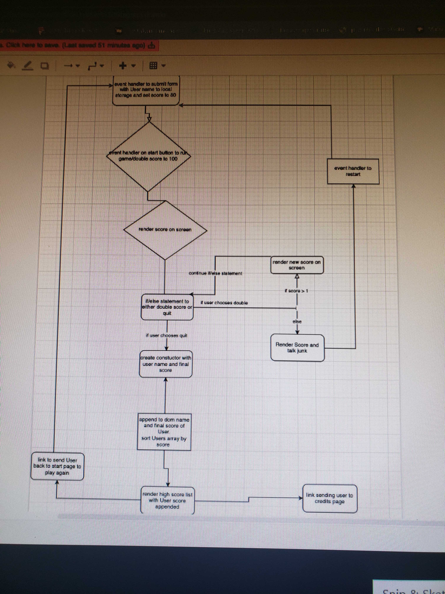
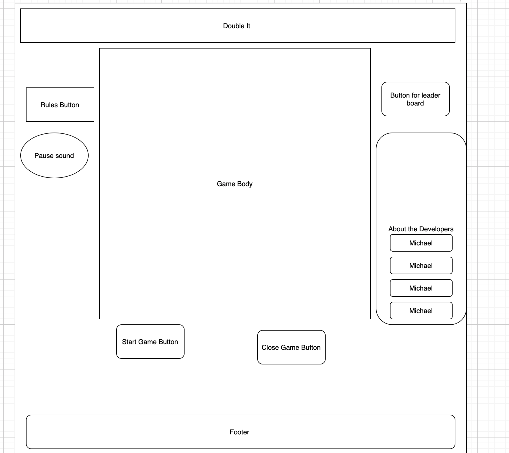
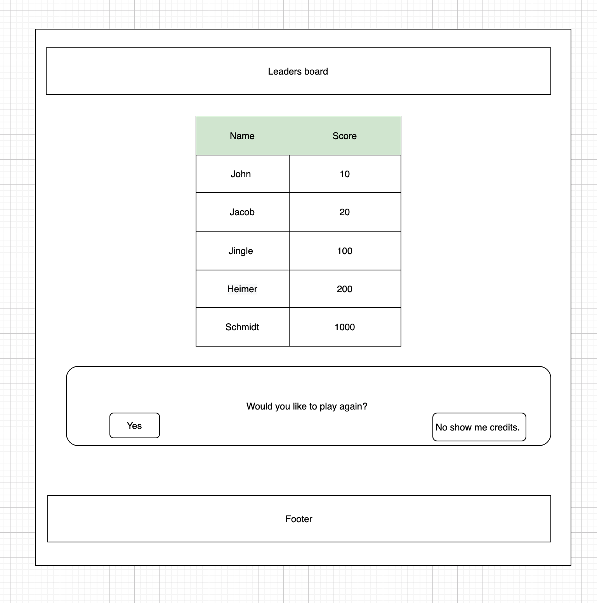
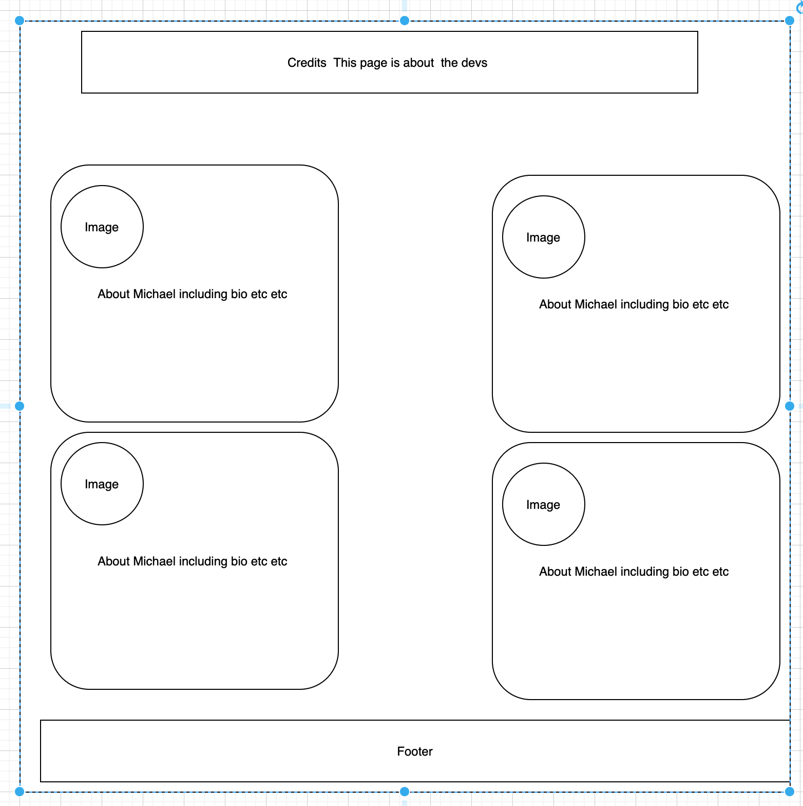

# 201 Final Project

## Double It!

We built a dynamic game where users can attempt to reach the Leaderboard by doubling score and quitting before losing everything.

### Authors: Michelle Pannosch, Alexander Williams, Garfield Grant, Michael Hendricks

### Links and Resources

* [submission PR](http://xyz.com)
* Any Links you used as reference
*  worked on by everyone 3/1
*  worked on by everyone 3/1
*  worked on by everyone 3/1
*  worked on by everyone 3/1
* TA's and Instructors who assisted
  * Paul O'Brian
  * Bryant Davis
  * Ryan Galloway

### Reflections and Comments

#### 3/1

* Garfield created index and board html's
* Alexander worked on the the main logic for the javascript doubling loop
* Michelle and Michael created the credit.html
* This is also a good place to reflect on the tools and resources used and learned

#### 3/2

* Garfield and Alex worked on the basic game loop
* Michelle and Michael looked for background images before joining in on Javascript

#### 3/3

* Michelle created the HTML for the about me page.
* Michael and Alexander continued to work on the JS
* Garfield started the CSS to render the main game

#### 3/4

* First Alexander and Michael, then the entire team mob coded the javascript to finish off main game loop.
* Michelle and Garfield continued to work on CSS

#### 3/6

* Garfield and Alexander both worked heavily with CSS mostly finished off the main page CSS.
* Garfield found animated backgrounds and added to some pages.
* Michelle formatted and styled to About Me page
* Michael added difficulty loops and settings.

#### 3/8

* Michael styled buttons to be fun and move
* Garfield styled linkes between pages to make clearer and othe CSS touch-ups
* Michelle created and worked on our presentation and slides
* Alexander unsuccessfully worked on adding music to our web page before hitting some major roadblocks. To be continued.

#### 3/9

* Team members writing "about me" paragraphs and final touchups while preparing for presentations.
